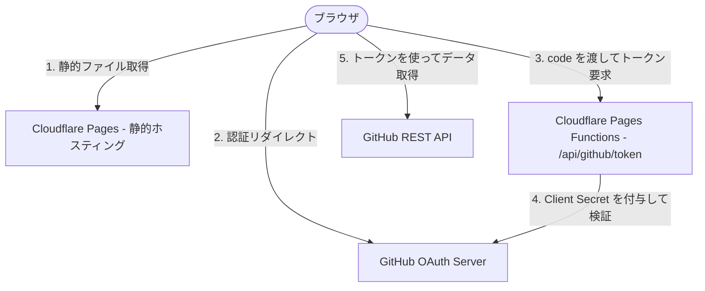
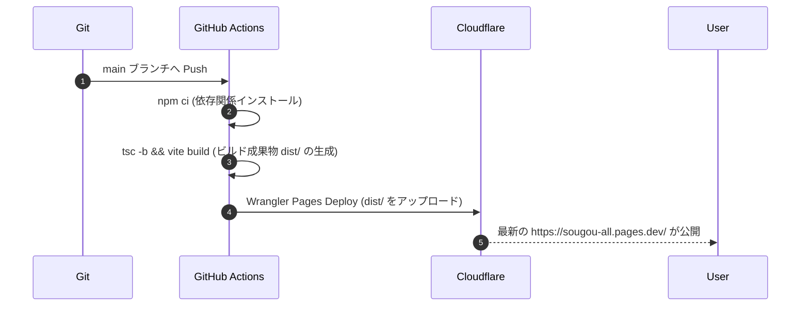

# Distribution Plan - Sougou Dashboard (sougou-all)

本ドキュメントは、`sougou-all`（Sougou Dashboard）のビルド・パッケージング、配布（デプロイ）構成、および必要な環境変数のセットアップ手順について説明します。

---

## 🏗 システム配置構成 (Architecture)

本システムはサーバーレスかつエッジファーストな静的ウェブホスティングおよびエッジ関数で構成されています。



| 役割 | ホスティング先 | ビルド成果物 / サービス名 |
| :--- | :--- | :--- |
| **フロントエンド (SPA)** | Cloudflare Pages | `dist/` (React + Vite 静的リソース) |
| **API Proxy (Token交換)** | Cloudflare Pages Functions | `functions/api/github/token.ts` |
| **外部認証プラットフォーム** | GitHub | GitHub OAuth Application |

---

## 🔑 環境変数設定 (Environment Variables)

OAuth 認証を正常に動作させるために、環境に応じたクライアント ID とシークレットの設定が必要です。

### 1. ローカル開発環境 (`.env.local`)
ローカルホスト（Vite 開発用プロキシ）で動作させるため、プロジェクトルート直下に `.env.local` ファイルを作成します。

```env
# GitHub OAuth 開発用アプリの認証情報
VITE_GITHUB_CLIENT_ID=Ov23liFWupK3e2e4v6IF
GITHUB_CLIENT_SECRET=e071fe0561c73b18cdaa48ccf1cd8d2329cc44fa
```

### 2. 本番環境 (Cloudflare Pages ダッシュボード)
本番環境では、Cloudflare Pages の管理画面にて以下の環境変数を登録します。
* **パス**: `Cloudflare Dashboard` -> `Workers & Pages` -> `sougou-all` -> `Settings` -> `Environment variables`

| 変数名 | 設定値の例 | 用途 |
| :--- | :--- | :--- |
| `GITHUB_CLIENT_ID` | `Ov23liFWupK3e2e4v6IF` (本番用) | ログイン画面でクライアントへ渡される ID |
| `GITHUB_CLIENT_SECRET` | *(非公開のクライアントシークレット)* | Functions 内部のみで参照される検証用キー |

> [!IMPORTANT]
> Cloudflare の環境変数を追加・変更した後は、設定を反映するためにプロジェクトの再デプロイ（または GitHub Actions の再実行）を行ってください。

---

## 🚀 ビルド & 配布フロー (CI/CD)

本プロジェクトは GitHub へのプッシュを契機に、GitHub Actions 経由で自動ビルドおよび Cloudflare Pages への自動デプロイが行われます。

### 1. ローカルでの検証
デプロイする前に、ローカルで以下のコマンドを実行し、エラーがないことを確認します。
```bash
# 静的解析チェック
npm run lint

# 単体・結合テストの実行
npm run test

# 静的ファイルのビルド確認
npm run build
```

### 2. 自動デプロイフロー (`.github/workflows/deploy.yml`)
`main` または `master` ブランチへ変更がプッシュされると、以下のフローで自動配布が実行されます。



---

## 📝 GitHub OAuth アプリケーション設定要件

デプロイ先URLでログインを動作させるために、GitHub のデベロッパー設定にて以下の通りコールバックURLが登録されている必要があります。

* **Application name**: `Sougou Portal`
* **Homepage URL**: `https://sougou-all.pages.dev/`
* **User authorization callback URL**: `https://sougou-all.pages.dev/` (およびローカルテスト用の `http://localhost:5173/`)
